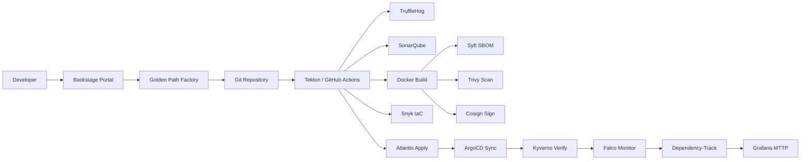
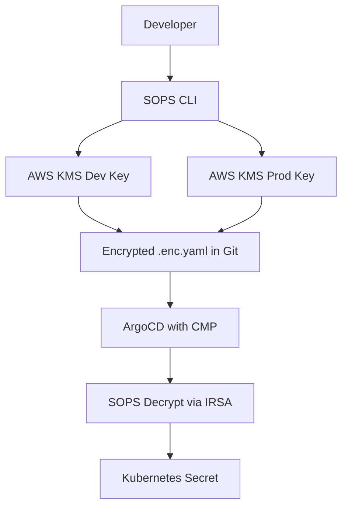
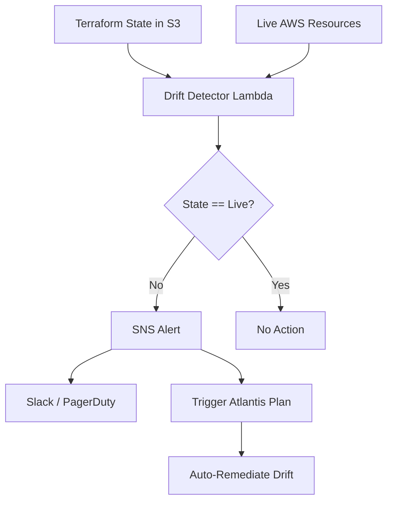

# NEXUS

"Nexus — A GitOps-native, zero-trust Internal Developer Platform with end-to-end DevSecOps supply chain. Developers self-serve production infrastructure in 8 minutes with automated security gates, drift detection, and compliance mapping."

---

## SECTION 1: What Happens When You Write Code

Here is the complete journey your code takes from your laptop to production — step by step.

1. **You write code locally and commit to Git.** Just like any other day. Nothing special yet.

2. **You push to a branch and open a Pull Request.** This is where the magic starts.

3. **GitHub Actions automatically runs a security pipeline.** It scans for secrets (TruffleHog), checks code quality (SonarQube), validates formatting, and runs policy checks. If any gate fails, the PR is blocked immediately.

4. **Atlantis receives the webhook and runs `terraform plan`.** It posts the infrastructure plan plus security scan results as a comment on your PR. You can see exactly what will change before it changes.

5. **Reviewers approve the PR.** On merge, Atlantis runs `terraform apply` automatically. No manual clicking in consoles.

6. **ArgoCD detects the Git commit change and syncs Kubernetes resources.** It pulls the new manifests from Git and applies them to the cluster. If someone manually changed something with `kubectl`, ArgoCD self-heals it back to what Git says within minutes.

7. **Kyverno checks every resource at admission.** It asks: Is the image signed with Cosign? Is it from our private registry? Does it have CPU and memory limits? Is it running as non-root? If any answer is no, the deployment is blocked instantly with a clear event log.

8. **Falco watches the running pods for runtime threats.** Crypto-mining? Reverse shell? Unauthorized `kubectl exec`? Falco detects it in real time and alerts via PagerDuty or Slack.

9. **If someone manually changes something in the cloud console, a Lambda detects it within 15 minutes.** It compares live AWS resources to the Terraform state. If they do not match, it alerts the team and can optionally trigger automatic remediation.

10. **Grafana dashboards track how fast vulnerabilities are patched.** The Mean Time To Patch (MTTP) dashboard shows, by team and severity, how long it takes from CVE publish to rebuilt image. If MTTP exceeds 7 days for critical issues, an alert fires.

---

## SECTION 2: What Is This Project

This is a platform where developers never need to touch infrastructure tools directly.

Everything is requested through a portal and delivered automatically with security built in from the first line of code.

Think of it like a vending machine: you press a button, and you get a fully built, secured, tracked environment. You do not need to know how the machine works inside. You just get what you asked for — every time, consistently, with guardrails.

---

## SECTION 3: The Pitch

"I built a platform where a developer logs into a portal, clicks 'New Microservice,' and 8 minutes later they have a production-ready, signed, scanned, SBOM-tracked service running on hardened EKS — without ever touching AWS, kubectl, or Terraform. Every change from VPC to DNS record flows through Git. Every secret is encrypted in Git with SOPS + KMS. Every image is signed with Cosign. If someone manually changes something in the AWS Console, a Lambda detects it in 15 minutes and auto-remediates. If a deployment fails, Git auto-reverts in staging. We track Mean Time To Patch CVEs on Grafana dashboards. Oh, and it maps to financial sector compliance frameworks and data protection regulations for enterprise companies."

---

## SECTION 4: Architecture Overview

### Full Platform Flow



### SOPS Encryption Flow



### Drift Detection & Auto-Remediation Loop



---

## SECTION 5: The 8-Minute Golden Path

When a developer clicks **"New Microservice"** in Backstage, here is what happens:

| Step      | What Gets Created                                           | Time           |
| --------- | ----------------------------------------------------------- | -------------- |
| 1         | Git repository from template                                | 30s            |
| 2         | Kubernetes namespace with labels, ResourceQuota, LimitRange | 45s            |
| 3         | NetworkPolicy (deny cross-namespace by default)             | 30s            |
| 4         | RBAC (team can only access their namespace)                 | 30s            |
| 5         | IRSA role for the service to access its own AWS resources   | 60s            |
| 6         | RDS Aurora PostgreSQL (if selected)                         | 90s            |
| 7         | SQS queue + DLQ (if selected)                               | 45s            |
| 8         | S3 bucket with encryption and lifecycle (if selected)       | 45s            |
| 9         | Tekton pipeline trigger configured                          | 30s            |
| 10        | `catalog-info.yaml` registered in Backstage                 | 15s            |
| **Total** |                                                             | **~8 minutes** |

The developer receives:

- A link to their new Git repository
- Backstage catalog entry
- Pre-configured CI/CD pipeline
- Fully scoped AWS permissions
- Security policies already enforced

---

## SECTION 6: Directory Structure

```
nexus-platform/
├── terraform.tfvars              # THE SINGLE SOURCE OF TRUTH
├── dev.tfvars                    # Minimal dev overrides
├── staging.tfvars                # Minimal staging overrides
├── prod.tfvars                   # Minimal prod overrides
├── Makefile                      # Bootstrap, plan, apply, validate, docs
├── README.md                     # This file
├── .pre-commit-config.yaml       # Git hooks for validation
│
├── terraform/
│   ├── backend.tf                # S3 + DynamoDB remote state
│   ├── providers.tf              # AWS, Helm, Kubernetes, GitHub
│   ├── data.tf                   # aws_caller_identity, AZs, EKS auth
│   ├── variables.tf              # Global variables with validation
│   ├── main.tf                   # Orchestrator calling all modules
│   └── modules/
│       ├── networking/           # VPC, subnets, endpoints, flow logs
│       ├── eks_platform/         # Hardened EKS, IRSA, node groups
│       ├── backstage_idp/        # Backstage portal, RDS, S3, SSO
│       ├── golden_path_factory/  # Namespace, RDS, SQS, S3, IRSA per service
│       ├── atlantis_gitops/      # Atlantis server, PR-based applies
│       ├── argocd_self_managed/  # ArgoCD managing itself via Application
│       ├── secrets_sops/         # SOPS + KMS config
│       ├── external_secrets/     # External Secrets Operator
│       ├── devsecops_pipeline/   # ECR repos, ARC runners, signing
│       ├── kyverno_policies/     # Admission control policies
│       ├── falco_runtime/        # Runtime threat detection
│       ├── drift_detection/      # Lambda + EventBridge drift checks
│       ├── rollback_system/      # Auto-revert on sync failure
│       ├── sbom_platform/        # Dependency-Track on EKS
│       ├── signing_infrastructure/ # KMS key for Cosign
│       ├── policy_engine/        # Conftest + OPA for Terraform
│       ├── cost_management/      # Kubecost + Infracost
│       ├── observability_sec/    # Prometheus + Grafana + PagerDuty
│       ├── docs_generator/       # terraform-docs + Mermaid diagrams
│       └── audit_logging/        # CloudTrail, S3 Object Lock
│
├── gitops/
│   ├── argocd-apps/
│   │   ├── self-management/      # ArgoCD manages its own Helm release
│   │   ├── infrastructure/       # Atlantis, monitoring apps
│   │   ├── teams/                # ApplicationSets for team repos
│   │   └── policies/             # Kyverno policies managed by ArgoCD
│   ├── atlantis/
│   │   ├── atlantis.yaml         # Repo-level config
│   │   ├── repo-config.yaml      # Allowed repos, workflows
│   │   └── workflows/
│   │       ├── default.yaml      # dev: init → plan → conftest → apply
│   │       └── strict.yaml       # prod: init → plan → conftest → opa → checkov → approval → apply
│   ├── sops/
│   │   ├── .sops.yaml            # Creation rules per environment
│   │   └── secrets/
│   │       ├── dev/
│   │       └── prod/
│   └── team-templates/
│       ├── standard-service/     # Kustomize base for microservices
│       └── standard-infra/       # Terraform module template
│
├── kubernetes/
│   ├── backstage/                # Deployment, ingress, catalog template
│   ├── atlantis/                 # StatefulSet, ingress, webhook secret
│   ├── argocd/                   # CMP plugin, RBAC, notifications
│   ├── kyverno/                  # ClusterPolicies + exceptions
│   ├── falco/                    # Custom rules, Falcosidekick values
│   ├── external-secrets/         # ClusterSecretStore, examples
│   ├── tekton/                   # Tasks, pipelines, triggers
│   └── grafana-dashboards/       # MTTP, supply chain, runtime, pipeline
│
├── policies/
│   ├── conftest/terraform/       # Rego policies for Terraform plans
│   ├── opa/terraform/            # Complex referential policies
│   └── kyverno-tests/            # kyverno-test.yaml suites
│
├── scripts/
│   ├── bootstrap-backend.sh      # Idempotent S3 + DynamoDB + KMS
│   ├── pre-flight-checks.sh      # AWS creds, tools, quotas
│   ├── install-sops.sh           # Mozilla SOPS installer
│   ├── rotate-sops-keys.sh       # Re-encrypt all secrets
│   ├── drift-detector.py         # Boto3 drift detection
│   ├── auto-rollback.sh          # Git revert on sync failure
│   ├── generate-docs.sh          # terraform-docs + Mermaid
│   ├── verify-deployment.sh      # Image signature, scan, SBOM check
│   ├── generate-sbom.sh          # Syft + Cosign sign
│   └── break-glass.sh            # Emergency manual access
│
├── .github/workflows/
│   ├── devsecops-pipeline.yml    # TruffleHog → SonarQube → Build → SBOM → Trivy → Cosign → Snyk → Deploy
│   ├── terraform-validation.yml  # fmt → validate → tflint → checkov → conftest
│   ├── sops-validation.yml       # Verify all .enc files are encrypted
│   └── atlantis-webhook.yml      # Validate Atlantis webhook signature
│
└── docs/
    ├── architecture/             # Auto-generated Mermaid diagrams
    ├── runbooks/                 # break-glass, drift-remediation, onboarding
    ├── compliance/               # Framework mapping, audit evidence
    └── decisions/                # Architecture Decision Records
```

---

## SECTION 7: Prerequisites

- **AWS CLI** v2.x with configured credentials
- **Terraform** 1.7+
- **kubectl** 1.29+
- **Helm** 3.13+
- **SOPS** 3.8+
- **Cosign** 2.2+
- **Trivy** 0.50+
- **Syft** 1.0+
- **Conftest** 0.49+
- **Kyverno CLI** 1.12+
- **Atlantis CLI** 0.27+ (optional, for local testing)
- **GitHub CLI** 2.40+ (optional)
- **Python** 3.11+ (for drift detection and docs generation)

---

## SECTION 8: Quick Start

### Step 1: Clone

```bash
git clone https://github.com/example-org/nexus-platform.git
cd nexus-platform
```

### Step 2: Edit ONLY `terraform.tfvars`

Open `terraform.tfvars` and set your critical variables:

- `aws_region`
- `allowed_account_ids`
- `vpc_cidr`
- `cluster_name`
- `backstage_domain`
- `atlantis_github_user`
- `pagerduty_integration_key`
- `common_tags`

### Step 3: Bootstrap

```bash
make bootstrap
```

This creates:

- S3 bucket for Terraform state
- DynamoDB table for state locking
- KMS key for state encryption

### Step 4: Plan and Apply

```bash
make plan
make apply
```

### Step 5: Configure GitHub Webhook for Atlantis

In your GitHub repository settings, add a webhook:

- **Payload URL**: `https://atlantis.nexus-platform.local/events`
- **Content type**: `application/json`
- **Secret**: From AWS Secrets Manager (`nexus/atlantis-github`)
- **Events**: Pull requests, Pushes

### Step 6: Encrypt a Secret with SOPS

```bash
# Edit the secret file
cat > gitops/sops/secrets/dev/my-secret.yaml <<EOF
apiVersion: v1
kind: Secret
metadata:
  name: my-secret
stringData:
  key: value
EOF

# Encrypt it
sops --encrypt --in-place gitops/sops/secrets/dev/my-secret.yaml

# Commit and push
git add gitops/sops/secrets/dev/my-secret.yaml
git commit -m "Add encrypted secret"
git push
```

### Step 7: Open Test PR

Create a branch, make a Terraform change, and open a PR. Watch Atlantis post the plan in the PR comments.

### Step 8: Merge and Watch ArgoCD Auto-Sync

Merge the PR. Atlantis applies Terraform. ArgoCD detects the Git change and syncs Kubernetes resources automatically.

### Step 9: Run Drift Check

```bash
make drift-check
```

---

## SECTION 9: Single-File Configuration

`terraform.tfvars` is the ONLY file you need to edit to customize the entire platform.

### Complete Annotated Example

```hcl
# =============================================================================
# PROJECT METADATA
# =============================================================================
project_name = "nexus"
environment  = "dev"
git_commit_sha       = "unknown"
git_repository_url   = "https://github.com/example-org/nexus-platform"
resource_description = "Nexus IDP managed infrastructure resource"
security_level = "hardened"  # standard | hardened | maximum

# =============================================================================
# AWS SETTINGS
# =============================================================================
aws_region           = "eu-west-1"
aws_secondary_region = "eu-central-1"
aws_profile          = "nexus-platform"
allowed_account_ids  = ["123456789012"]

# =============================================================================
# NETWORKING
# =============================================================================
vpc_cidr           = "10.0.0.0/16"
availability_zones = ["eu-west-1a", "eu-west-1b", "eu-west-1c"]
public_subnet_cidrs   = ["10.0.0.0/20", "10.0.16.0/20", "10.0.32.0/20"]
private_subnet_cidrs  = ["10.0.48.0/20", "10.0.64.0/20", "10.0.80.0/20"]
database_subnet_cidrs = ["10.0.96.0/20", "10.0.112.0/20", "10.0.128.0/20"]
enable_nat_gateway     = true
single_nat_gateway     = false
enable_flow_logs       = true
flow_logs_retention_days = 2555
enable_vpc_endpoints = ["s3", "ecr-api", "ecr-dkr", "secretsmanager", "logs", "sts"]

# =============================================================================
# EKS PLATFORM
# =============================================================================
cluster_name    = "nexus-platform"
cluster_version = "1.29"
cluster_endpoint_public_access  = true
cluster_endpoint_private_access = true

node_groups = {
  system = {
    desired_size   = 2
    min_size       = 2
    max_size       = 6
    instance_types = ["m6i.xlarge"]
    capacity_type  = "ON_DEMAND"
    disk_size      = 100
    labels = { workload-type = "system", cost-center = "platform" }
    taints = []
  }
  workloads = {
    desired_size   = 3
    min_size       = 2
    max_size       = 20
    instance_types = ["m6i.2xlarge", "m5.2xlarge"]
    capacity_type  = "SPOT"
    disk_size      = 100
    labels = { workload-type = "workloads", cost-center = "shared" }
    taints = []
  }
}

cluster_pod_security_standard = "restricted"
enable_guardduty    = true
enable_security_hub = true

# =============================================================================
# BACKSTAGE IDP
# =============================================================================
backstage_enabled       = true
backstage_domain        = "backstage.nexus-platform.local"
backstage_replicas      = 2
backstage_image_tag     = "1.22.0"
backstage_db_instance_class = "db.r6g.large"
backstage_db_multi_az   = true
backstage_db_backup_retention = 7
backstage_techdocs_bucket_prefix = "nexus-techdocs"
keycloak_realm     = "platform-engineering"
keycloak_client_id = "backstage"
enable_keycloak_sso = true

# =============================================================================
# ARGOCD
# =============================================================================
argocd_enabled       = true
argocd_version       = "2.10.0"
argocd_domain        = "argocd.nexus-platform.local"
argocd_admin_enabled = false
argocd_sso_enabled   = true
argocd_self_heal     = true
argocd_prune         = true

# =============================================================================
# ATLANTIS GITOPS
# =============================================================================
atlantis_enabled        = true
atlantis_version        = "0.27.0"
atlantis_domain         = "atlantis.nexus-platform.local"
atlantis_github_user    = "nexus-atlantis"
atlantis_repo_whitelist = ["github.com/example-org/*"]
atlantis_dynamodb_table = "nexus-atlantis-locks"

# =============================================================================
# SECURITY TOOLING
# =============================================================================
kyverno_enabled          = true
kyverno_version          = "3.2.0"
kyverno_policies_enforce = true
falco_enabled           = true
falco_version           = "0.37.0"
falco_ebpf_enabled      = true
falcosidekick_enabled   = true
enable_cosign_kms       = true
cosign_kms_key_alias    = "alias/nexus-cosign"
enable_keyless_signing  = true
external_secrets_enabled = true
external_secrets_version = "0.9.0"

# =============================================================================
# DEVSECOPS PIPELINE
# =============================================================================
ecr_repository_prefix = "nexus"
ecr_scan_on_push      = true
ecr_immutable_tags    = true
ecr_lifecycle_count   = 30
enable_arc            = true
arc_namespace         = "arc-runners"
arc_runner_replicas   = 2

# =============================================================================
# OBSERVABILITY
# =============================================================================
enable_prometheus      = true
enable_grafana         = true
grafana_domain         = "grafana.nexus-platform.local"
grafana_admin_password = "CHANGE_ME_IN_SOPS"
pagerduty_integration_key = "dummy-key-replace-in-sops"
enable_cloudwatch_logs = true
log_retention_days     = 90

# =============================================================================
# COST MANAGEMENT
# =============================================================================
enable_kubecost   = true
kubecost_domain   = "kubecost.nexus-platform.local"
infracost_enabled = true
infracost_api_key = "dummy-key-replace-in-sops"
cost_centers = {
  team-platform = "platform-engineering"
  team-backend  = "backend-squad"
  team-data     = "data-platform"
  team-frontend = "frontend-guild"
}

# =============================================================================
# DRIFT DETECTION
# =============================================================================
drift_detection_enabled  = true
drift_check_interval     = "rate(15 minutes)"
drift_auto_remediate     = false
drift_notification_email = "platform-alerts@example.com"

# =============================================================================
# ROLLBACK SYSTEM
# =============================================================================
rollback_auto_staging      = true
rollback_requires_approval = true

# =============================================================================
# SBOM PLATFORM
# =============================================================================
dependency_track_enabled  = true
dependency_track_domain   = "dependency-track.nexus-platform.local"
dependency_track_db_class = "db.r6g.large"

# =============================================================================
# AUDIT & COMPLIANCE
# =============================================================================
enable_cloudtrail        = true
cloudtrail_bucket_prefix = "nexus-cloudtrail"
audit_retention_years    = 7
enable_mfa_delete        = true
compliance_framework     = "financial-sector-cybersecurity-framework"
data_protection_regulation = "data-protection-regulation"

# =============================================================================
# SECRETS MANAGEMENT
# =============================================================================
sops_enabled          = true
sops_kms_key_arn_dev  = "arn:aws:kms:eu-west-1:123456789012:key/REPLACE-ME"
sops_kms_key_arn_prod = "arn:aws:kms:eu-west-1:123456789012:key/REPLACE-ME"

# =============================================================================
# MTTP & POLICY THRESHOLDS
# =============================================================================
mttp_threshold_days       = 7
mttp_critical_threshold   = 3
mttp_high_threshold       = 7
max_allowed_critical_cves = 0
max_allowed_high_cves     = 5

# =============================================================================
# COMMON TAGS
# =============================================================================
common_tags = {
  Project    = "nexus"
  ManagedBy  = "terraform"
  Repository = "nexus-platform"
  Owner      = "platform-engineering"
  CostCenter = "platform"
}
```

### Environment Overrides

`dev.tfvars`, `staging.tfvars`, and `prod.tfvars` override only specific values:

```hcl
# prod.tfvars
environment                    = "prod"
cluster_endpoint_public_access = false
security_level                 = "maximum"
drift_auto_remediate           = true
rollback_requires_approval     = true
```

---

## SECTION 10: Security Gates Explained

| Gate                     | What It Catches                                             | What It Blocks                                    |
| ------------------------ | ----------------------------------------------------------- | ------------------------------------------------- |
| **Secret Scan**          | Hardcoded passwords, API keys, tokens in Git                | Commit with verified secrets                      |
| **SAST**                 | Code quality issues, bugs, security anti-patterns           | PR merge if coverage < 80% or critical bugs exist |
| **Dependency Scan**      | Known CVEs in third-party libraries                         | Build if direct HIGH CVE found                    |
| **Container Scan**       | OS and application vulnerabilities in images                | Deployment if HIGH/CRITICAL CVEs exceed threshold |
| **Image Sign**           | Unsigned or tampered container images                       | Deployment to production                          |
| **IaC Scan**             | Misconfigurations in Terraform (public S3, unencrypted EBS) | Terraform apply if HIGH/CRITICAL                  |
| **Runtime Verification** | Crypto-mining, reverse shells, unauthorized exec            | Running pods (Kyverno blocks, Falco alerts)       |

---

## SECTION 11: Policy as Code Catalog

### Conftest Policies (Terraform Plans)

| Policy                       | Severity | Scope                                                               |
| ---------------------------- | -------- | ------------------------------------------------------------------- |
| `no_public_s3.rego`          | Critical | S3 buckets must block all public access                             |
| `encryption_required.rego`   | Critical | EBS, RDS, S3 must have encryption                                   |
| `required_tags.rego`         | High     | Every resource must have Environment, Team, CostCenter, Description |
| `mandatory_annotations.rego` | Medium   | Every resource must have description and managed-by annotations     |
| `deny_root_account.rego`     | Critical | No IAM policy can allow root account                                |

### Kyverno Policies (Kubernetes Admission)

| Policy                          | Severity | Scope                                                       |
| ------------------------------- | -------- | ----------------------------------------------------------- |
| `verify-image-signatures`       | Critical | Reject unsigned images (Cosign KMS verification)            |
| `restrict-image-registries`     | Critical | Reject non-ECR images                                       |
| `require-resource-limits`       | High     | CPU/memory limits mandatory                                 |
| `require-non-root`              | Critical | runAsNonRoot, readOnlyRootFilesystem, drop ALL capabilities |
| `require-gitops-annotations`    | Medium   | ArgoCD tracking ID mandatory                                |
| `block-manual-secrets`          | High     | Prevent `kubectl create secret`                             |
| `enforce-resource-descriptions` | Low      | metadata.annotations.description required                   |

---

## SECTION 12: Drift Detection & Remediation

### How It Works

A Python Lambda runs every 15 minutes on EventBridge. It:

1. Downloads the Terraform state from S3
2. Uses Boto3 to describe live AWS resources
3. Compares state to live for 6+ resource types:
   - EC2 instances
   - Security Groups
   - IAM policies
   - S3 buckets
   - Route53 records
   - RDS instances

### What It Detects

- **Missing in AWS**: Resource exists in state but was deleted manually
- **Tag changes**: Tags modified in the console
- **Configuration drift**: Security group rules added, policies modified

### Alerts

- **SNS** → Email
- **Slack** (#platform-alerts)
- **PagerDuty** (for production drift)

### Remediation

- **Auto-remediate** (`drift_auto_remediate = true`): Triggers Atlantis plan/apply
- **Manual**: Engineer decides to import the change or revert it

---

## SECTION 13: Rollback Mechanics

### Terraform Rollback

Atlantis stores plan files. To rollback:

1. Revert the Git commit
2. Atlantis auto-applies on merge

### Kubernetes Rollback

ArgoCD `syncPolicy.automated.selfHeal: true` reverts manual `kubectl` changes within 5 minutes.

### Automated Staging Revert

If ArgoCD sync fails in staging, a Lambda:

1. Receives the SNS notification
2. Calls GitHub API to revert the last commit
3. ArgoCD syncs the reverted state

### Production Rollback

Requires manual approval via Slack workflow before any revert.

---

## SECTION 14: Secrets Strategy

### SOPS + AWS KMS

- Secrets are encrypted in Git using Mozilla SOPS
- Each environment has its own KMS key
- `.sops.yaml` defines creation rules per path regex
- Only Atlantis role and break-glass role can decrypt

### External Secrets Operator

- Syncs secrets from AWS Secrets Manager to Kubernetes
- Uses IRSA for authentication
- Deletion policy: Retain (secrets stay in AWS even if K8s secret is deleted)

### Why Not Vault or Sealed Secrets?

- **Vault**: Adds operational complexity; requires HA setup, unsealing, and dedicated expertise
- **Sealed Secrets**: Tied to a specific cluster; multi-cluster rotation is painful
- **SOPS + ESO**: Simple, Git-native, works across any cluster, no runtime secret management needed

### Break-Glass Rotation

```bash
make rotate-sops-keys
```

Re-encrypts all secrets with new KMS keys.

---

## SECTION 15: Compliance Mapping

| Component                    | Control Category         | Framework Mapping                        |
| ---------------------------- | ------------------------ | ---------------------------------------- |
| SOPS + KMS                   | Encryption at Rest       | Data Protection Regulation               |
| External Secrets Operator    | Secret Management        | Data Protection Regulation               |
| Kyverno Image Signatures     | Software Integrity       | Financial Sector Cybersecurity Framework |
| Kyverno Registry Restriction | Supply Chain Security    | Financial Sector Cybersecurity Framework |
| Kyverno Non-Root Enforcement | Least Privilege          | Financial Sector Cybersecurity Framework |
| Falco Runtime Detection      | Intrusion Detection      | Financial Sector Cybersecurity Framework |
| CloudTrail + S3 Object Lock  | Audit Logging            | Data Protection Regulation               |
| VPC Flow Logs                | Network Monitoring       | Financial Sector Cybersecurity Framework |
| GuardDuty + Security Hub     | Threat Detection         | Financial Sector Cybersecurity Framework |
| Drift Detection              | Change Control           | Financial Sector Cybersecurity Framework |
| Atlantis PR-Based Apply      | Segregation of Duties    | Financial Sector Cybersecurity Framework |
| Conftest + OPA Policies      | Policy Enforcement       | Financial Sector Cybersecurity Framework |
| SBOM Generation              | Asset Inventory          | Financial Sector Cybersecurity Framework |
| Dependency-Track             | Vulnerability Management | Financial Sector Cybersecurity Framework |
| Break-Glass Procedures       | Emergency Access         | Financial Sector Cybersecurity Framework |
| MFA Delete on State Buckets  | Data Protection          | Data Protection Regulation               |

---

## SECTION 16: Cost Management

### Kubecost

- Per-team dashboards showing spend by namespace and label
- AWS CUR integration for accurate billing
- Daily alerts if spend exceeds threshold

### Infracost

- Comments on PRs with estimated cost impact of Terraform changes
- Configuration in `terraform.tfvars`: `infracost_enabled = true`

### Budget Alerts

- Daily spend > threshold → Slack alert
- Namespace spend > 150% of average → Email to team lead

---

## SECTION 17: Troubleshooting

### Atlantis Plan Fails

```bash
# Check Atlantis logs
kubectl logs -n atlantis -l app=atlantis --tail=100

# Common causes:
# - Backend S3 bucket not accessible (check IRSA role)
# - Terraform lock in DynamoDB (wait or manually delete)
# - Invalid tfvars syntax
```

### ArgoCD Sync Stuck

```bash
# Check ArgoCD UI or CLI
argocd app get <app-name>

# Common causes:
# - Resource conflict (manual change exists)
# - Kyverno blocking admission
# - Missing CRDs
```

### Conftest Failure

```bash
# Run locally to debug
terraform show -json tfplan > plan.json
conftest test plan.json -p policies/conftest/terraform
```

### SOPS Decryption Error

```bash
# Verify KMS key access
aws kms decrypt --ciphertext-blob fileb://<(sops -d file.enc.yaml) --query Plaintext

# Common causes:
# - Wrong AWS profile
# - KMS key policy blocks your role
# - File corrupted
```

### Kyverno Blocking Valid Deployment

```bash
# Check Kyverno events
kubectl get events -n kyverno --field-selector reason=PolicyViolation

# Temporarily switch to Audit mode (not recommended for prod)
# Edit ClusterPolicy: validationFailureAction: Audit
```

### Drift False Positives

Add exclusions to `scripts/drift-detector.py` for expected changes:

- AWS-managed tags
- Auto-scaling events
- Backup snapshots

### Runner Pod Pending

```bash
# Check ARC runner pods
kubectl get pods -n arc-runners

# Common causes:
# - Insufficient cluster resources
# - Node affinity constraints
# - Image pull errors
```

---

## SECTION 18: Break-Glass Procedures

### When Manual Access Is Justified

- Critical production incident with no automated fix
- Terraform state corruption
- Complete platform outage
- Security incident requiring immediate isolation

### Approval Workflow

1. **Request**: `make break-glass` or `./scripts/break-glass.sh "reason" "approver"`
2. **4-Eyes Approval**: Senior engineer or on-call approves via Slack
3. **Logging**: All access logged to CloudTrail, Slack, PagerDuty
4. **Timebox**: 1 hour maximum
5. **Post-Incident**: All manual changes imported back into Terraform

### Commands

```bash
# Request access
./scripts/break-glass.sh "Database corruption - manual recovery required" "senior@example.com"

# Import manual changes afterward
terraform import aws_instance.example i-1234567890abcdef0
```

---

## SECTION 19: Team Onboarding

### How to Add a New Team

1. **Add team to `terraform.tfvars`**:

   ```hcl
   cost_centers = {
     team-new = "new-squad"
   }
   ```

2. **Create ApplicationSet** in `gitops/argocd-apps/teams/`

3. **Grant repo access** in GitHub organization settings

4. **Provision SOPS key** for team-specific secrets

5. **Set up Kubecost allocation** label: `team=team-new`

### Verification

```bash
# Check namespace created
kubectl get namespaces | grep team-new

# Check RBAC
kubectl auth can-i --list --as=system:serviceaccount:team-new:default

# Check cost allocation in Kubecost
```

---

## SECTION 20: Roadmap

| Quarter | Initiative                                                     |
| ------- | -------------------------------------------------------------- |
| Q1      | Terraform Cloud Enterprise migration for advanced governance   |
| Q2      | Crossplane multi-cloud abstraction layer                       |
| Q3      | Sentinel policy engine integration for Terraform Enterprise    |
| Q4      | Automated patch PRs — Dependabot + Renovate for infrastructure |

---

## Built With

- Terraform 1.7+
- AWS EKS 1.29
- ArgoCD 2.10
- Atlantis 0.27
- Kyverno 1.12
- Falco 0.37
- Backstage 1.22
- Prometheus + Grafana
- Cosign 2.2
- SOPS 3.8

## License

Proprietary — Internal Use Only
